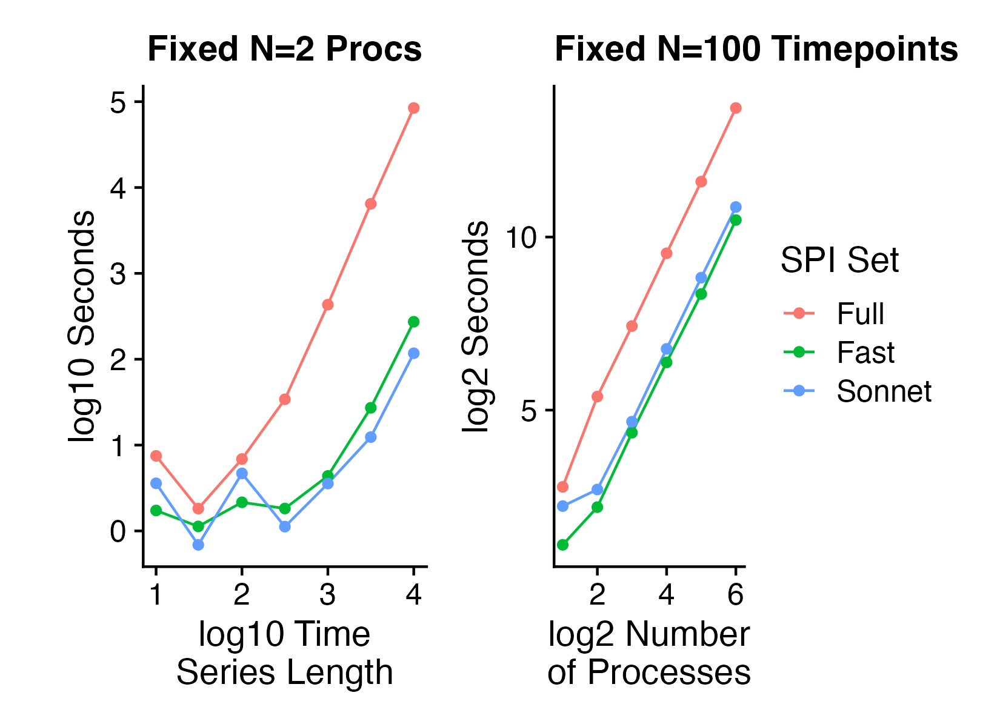
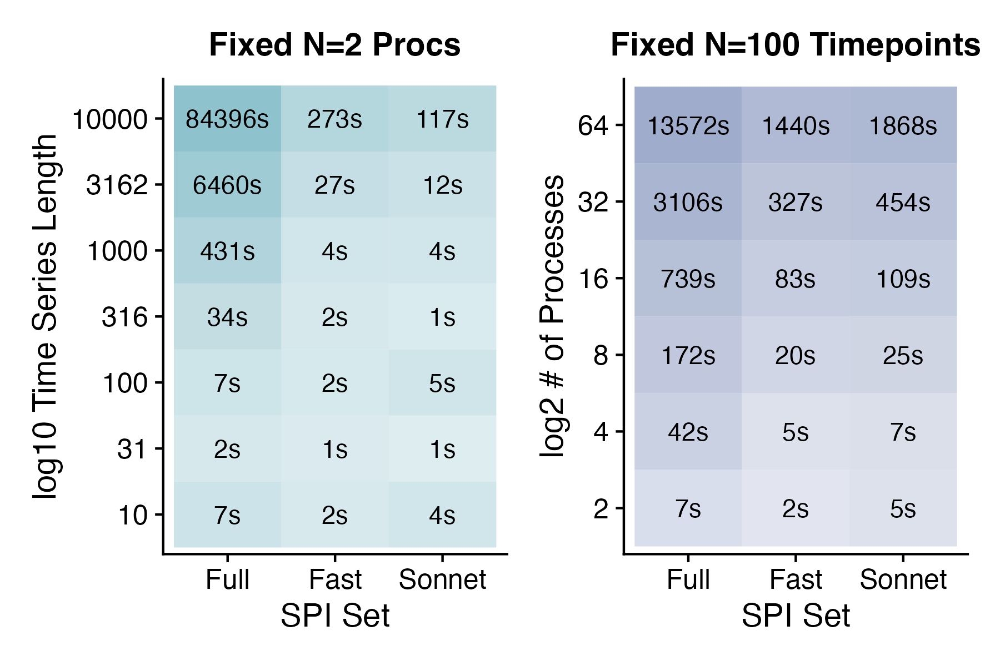

Issues & FAQ
===================================

FAQ
########

How many SPIs should I measure for my dataset?
**********************

When first starting out, we recommend that users start with a smaller subset of available SPIs first, so they get a sense of computation times and working with the output in a lower-dimensional space.
Users have the option to pass in a customized configuration `.yaml` file as described in the `Using a reduced SPI set <https://pyspi-toolkit.readthedocs.io/en/latest/advanced.html#using-a-reduced-spi-set>`_ documentation.

Alternatively, we provide two pre-defined subsets of SPIs that can serve as good starting points: `sonnet` and `fast`.
The `sonnet` subset includes 14 SPIs selected to represent the 14 modules identified through hierarchical clustering in the original paper.
To retain as many SPIs as possible while minimizing computation time, we also offer a `fast` option that omits the most computationally expensive SPIs.
Either SPI subset can be toggled by setting the corresponding flag in the `Calculator()` function call as follows: 

.. code-block:: 

    from pyspi import Calculator
    calc = Calculator(sonnet=True) # or calc = Calculator(fast=True)

How long does pyspi take to run?
**********************

This depends on the size of your multivariate time series (MTS) data -- both the number of processes and the number of time points.
In general, we recommend that users try running `pyspi` first with a small representative sample from their dataset to assess time and computing requirements, and scaling up accordingly.
The amount of time also depends on the feature set you're using -- whether it's the full set of all SPIs or a reduced set (like `sonnet` or `fast` described above).

To give users a sense of how long `pyspi` takes to run, we ran a series of experiments on a high-performing computing cluster with 2 cores, 2 MPI, and 40GB memory.
We ran `pyspi` on simulated NumPy arrays with either a fixed number of processes (2) or fixed number of time points (100) to see how timing scales with the array size.
Here are the results:

The above figure shows how the time to run `pyspi` scales with the number of time points (left) or number of processes (right).
We note that computation times for the `sonnet` and `fast` subset are roughly equivalent, and the full set of SPIs requires increasingly large amounts of time to compute with increasing time series lengths.
The computation time for the full set of SPIs increases with a consistent slope to that of the `sonnet` and `fast` subsets with increasing number of processes (right).

Here are the timing values for each condition, which can help users estimate the computation time requirements for their dataset:

Issues
########

Not locating system's octave and/or Java paths (specific to Windows)
**********************

If you are using Windows and you get an error that `pyspi` cannot locate your system's octave and/or Java paths, you can manually set these paths prior to importing `pyspi`: 

.. code-block:: 

    import os
    pathToExecutable = "C:/Program Files/GNU Octave/Octave-8.2.0/mingw64/bin/octave-cli.exe" # Change if your octave client is installed elsewhere
    pathToJAVA_HOME = "C:/Program Files/Java/jdk-20" # Change if you use a different Java JDK
    os.environ['OCTAVE_EXECUTABLE'] = pathToExecutable
    os.environ['JAVA_HOME'] = pathToJAVA_HOME

Thank you to GitHub user `rmzargar <https://github.com/rmzargar>`_ for reporting this issue and providing the solution.

Error with Int64Index with pandas
**********************

If you encounter the following error:
.. code-block:: 

    ImportError: cannot import name 'Int64Index' from 'pandas'

You can fix this by manually removing `numpy` and `pandas`, and manually reinstalling the below specific versions with the following code:
.. code-block:: 

    pip uninstall numpy
    pip uninstall pandas
    pip install numpy==1.21.1
    pip install pandas==1.3.3

Thank you to GitHub user `rmzargar <https://github.com/rmzargar>`_ for reporting this issue and providing the solution.

Java JVM DLL not found (specific to Mac)
**********************

One user reported the following error when installing `pyspi` on a MacBook Air an M2 chip and Catalina OS:

.. code-block::

   OSError: [Errno 0] JVM DLL not found /Library/Java/JavaVirtualMachines/jdk-19.jdk/Contents/Home/lib/libjli.dylib

This issue is similar to those reported `here <https://stackoverflow.com/questions/71504214/jvm-dll-not-found-but-i-can-clearly-see-the-file>`_ and `here <https://github.com/jpype-project/jpype/issues/994>`_; it can arise from the version of OpenJDK identified as the system default. Some Java versions don't include all of the binary (DLL) files that `pyspi` looks for.

We recommend following this `helpful tutorial <https://blog.bigoodyssey.com/how-to-manage-multiple-java-version-in-macos-e5421345f6d0>`_ by Chamika Kasun to install `AdoptOpenJDK <https://adoptopenjdk.net/index.html>`_. In a nutshell, here are the steps you should run:

Install homebrew if you don't already have it:

.. code-block::

   $ /bin/bash -c "$(curl -fsSL https://raw.githubusercontent.com/Homebrew/install/HEAD/install.sh)"

Install `jenv` as your Java version manager:

.. code-block:: 

    $ brew install jenv

Add `jenv` to your shell's configuration file (e.g. `.bashrc` if you use `bash`):

.. code-block:: 

    $ export PATH="$HOME/.jenv/bin:$PATH"
    $ eval "$(jenv init -)"

Source your shell's configuration file:

.. code-block:: 

    $ source ~/.bashrc # If you use bash

Confirm proper installation of `jEnv`:

.. code-block::

    $ jenv doctor

Even if this returns some errors, as long as you see `Jenv is correctly loaded`, you're all set. We recommend using `AdoptOpenJDK` version 11, which you can install with the following command:

.. code-block:: 

    $ brew install AdoptOpenJDK/openjdk/adoptopenjdk11

Now, you will need to add your `AdoptOpenJDK` path to your `jEnv` environments. First, you can find where your jdk files are installed with the following command:

.. code-block:: 

    $ /usr/libexec/java_home -V

This will list all your installed java JDK versions. Locate the one for `AdoptOpenJDK` version 11 and paste the path:

.. code-block::

    $ jenv add <path_to_adopt_open_jdk_11>

Confirm `AdoptOpenJDK` version 11 was added to `jEnv`:

.. code-block:: 

    $ jenv versions

You can set `AdoptOpenJDK` version 11 as your global Java version with the following:

.. code-block:: 

    $ jenv global <AdoptOpenJDK version>
    $ # example:
    $ jenv global 11.0