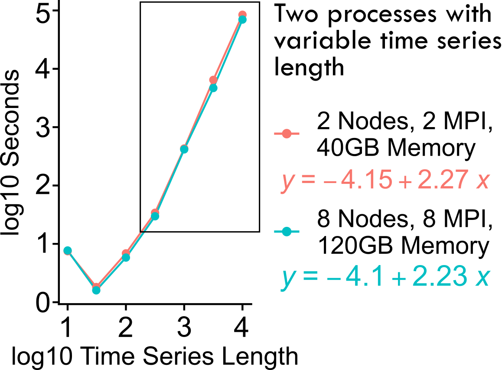
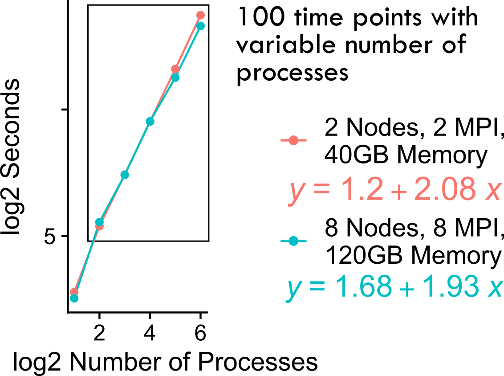

Issues & FAQ
===================================

FAQ
########

How long does pyspi take to run?
**********************

In short, this depends on the number of processes in your multivariate time series (MTS) and the number of time points in your MTS. 
We experimented with simulated NumPy arrays with either a fixed number of processes (2) or fixed number of time points (100) to see how timing scales with the array size.

Here are the results when we fix the number of processes to 2, and increase the number of time points from 10^1 to 10^4 by increments of 0.5:

   This graph shows the log10-seconds versus log10-number of time points for fixed number of processes (2). 
   The colors indicate the computing resources used for each job on a high-performing computing cluster for comparison: pink corresponds to 2 cores, 2 MPI, 40GB memory.
   Teal corresponds to 8 cores, 8 MPI, 120GB memory.
   The black box outlines the stable linear range of the graph, to which we fit an ordinary least squares regression and report the equations for the lines of best fit.

As the above figure indicates, the time to run `pyspi` scales linearly with the number of time points -- beyond a certain number of time points (>10^2.5, ~= 316).
We note there is a dropoff in computation time going from 10^1 to 10^1.5, which arises from errors for certain SPIs that require more than 10 points to compute; side note, we recommend using pyspi for MTS with > 10 time points.
If you have a dataset with more than 10^4 (10,000) time points, you can use the linear regression equation that more closely matches your computing resources to estimate the time to run pyspi.
For example, if you have 20,000 (10^4.3) time points, you can use the equation for the pink line to estimate the time to run pyspi:
y = -4.15 + 2.27x
log10(seconds) = -4.15 + 2.27*log10(20,000) --> 4.1 * 10^5 seconds --> 4.7 days

Given that, we recommend that users try downsampling their MTS data if they have substantially more than 10,000 time points.

Here are the results when we fix the number of time points to 100, and increase the number of processes from 2^1 to 2^6 by increments of 1:

   This graph shows the log2-seconds versus log2-number of processes for afixed number of timepoints (100). 
   The colors indicate the computing resources used for each job on a high-performing computing cluster for comparison: pink corresponds to 2 cores, 2 MPI, 40GB memory.
   Teal corresponds to 8 cores, 8 MPI, 120GB memory.
   The black box outlines the stable linear range of the graph, to which we fit an ordinary least squares regression and report the equations for the lines of best fit.

This indicates that the time to run `pyspi` scales linearly with the number of processes -- beyond a certain number of processes (>4).
If you have a dataset with more than 2^6 (64) processes and want to compute all 283 SPIs for all pairs of processes, you can use the linear regression equation that more closely matches your computing resources to estimate the time to run pyspi.
For example, if you have 100 (2^6.32) processes, you can use the equation for the pink line to estimate the time to run pyspi:
y = 1.68 + 1.93x
log2(seconds) = 1.68 + 1.93*log2(100) --> 2.3 * 10^4 seconds --> 6.4 hours

########

Java JVM DLL not found (specific to Mac)
**********************

One user reported the following error when installing `pyspi` on a MacBook Air an M2 chip and Catalina OS:

.. code-block::

   OSError: [Errno 0] JVM DLL not found /Library/Java/JavaVirtualMachines/jdk-19.jdk/Contents/Home/lib/libjli.dylib

This issue is similar to those reported `here <https://stackoverflow.com/questions/71504214/jvm-dll-not-found-but-i-can-clearly-see-the-file>`_ and `here <https://github.com/jpype-project/jpype/issues/994>`_; it can arise from the version of OpenJDK identified as the system default. Some Java versions don't include all of the binary (DLL) files that `pyspi` looks for.

We recommend following this `helpful tutorial <https://blog.bigoodyssey.com/how-to-manage-multiple-java-version-in-macos-e5421345f6d0>`_ by Chamika Kasun to install `AdoptOpenJDK <https://adoptopenjdk.net/index.html>`_. In a nutshell, here are the steps you should run:

Install homebrew if you don't already have it:

.. code-block::

   $ /bin/bash -c "$(curl -fsSL https://raw.githubusercontent.com/Homebrew/install/HEAD/install.sh)"

Install `jenv` as your Java version manager:

.. code-block:: 

    $ brew install jenv

Add `jenv` to your shell's configuration file (e.g. `.bashrc` if you use `bash`):

.. code-block:: 

    $ export PATH="$HOME/.jenv/bin:$PATH"
    $ eval "$(jenv init -)"

Source your shell's configuration file:

.. code-block:: 

    $ source ~/.bashrc # If you use bash

Confirm proper installation of `jEnv`:

.. code-block::

    $ jenv doctor

Even if this returns some errors, as long as you see `Jenv is correctly loaded`, you're all set. We recommend using `AdoptOpenJDK` version 11, which you can install with the following command:

.. code-block:: 

    $ brew install AdoptOpenJDK/openjdk/adoptopenjdk11

Now, you will need to add your `AdoptOpenJDK` path to your `jEnv` environments. First, you can find where your jdk files are installed with the following command:

.. code-block:: 

    $ /usr/libexec/java_home -V

This will list all your installed java JDK versions. Locate the one for `AdoptOpenJDK` version 11 and paste the path:

.. code-block::

    $ jenv add <path_to_adopt_open_jdk_11>

Confirm `AdoptOpenJDK` version 11 was added to `jEnv`:

.. code-block:: 

    $ jenv versions

You can set `AdoptOpenJDK` version 11 as your global Java version with the following:

.. code-block:: 

    $ jenv global <AdoptOpenJDK version>
    $ # example:
    $ jenv global 11.0