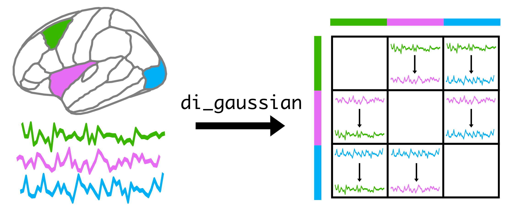

Usage
=====

Getting Started
---------------

In order to demonstrate the functionality of this software, we will first need a sample multivariate time series (MTS).
We will use data generated from a multivariate Gaussian:

.. code-block::

   import numpy as np
   import random

   random.seed(42)

   M = 5 # 5 processes
   T = 500 # 500 observations

   dataset = np.random.randn(M,T)

Now, given our dataset, we can instantiate the :class:`~pyspi.calculator.Calculator` object:

.. code-block::

   from pyspi.calculator import Calculator

   calc = Calculator(dataset=dataset)

And, using only the :meth:`~pyspi.calculator.Calculator.compute` method, we can compute over 250 statistics for analysing pairwise interactions in the MTS.

.. code-block::

   calc.compute()

.. note::
   While we tried to make the calculator as efficient as possible, computing all statistics can take a while (depending on the size of your dataset).
   You can use a faster set of statistics by instantiating the calculator with :code:`subset=fast`, see :class:`~pyspi.calculator.Calculator`.
   We also provide a reduced set of statistics that are useful for many applications, with the option for users to design their own subset of statistics; see :ref:`Using a reduced SPI set`.

Once the calculator has computed each of the statistics, you can access all values using the :attr:`~pyspi.calculator.Calculator.table` property:

.. code-block::

   print(calc.table)

Or, extract one matrix of pairwise interactions (MPI) for a given method using their unique `identifier`.
For instance, the following code will extract the covariance matrix computed with the maximum likelihood estimator:

.. code-block::

   print(calc.table['cov_EmpiricalCovariance'])

The identifiers for many of the statistics are outlined in the Supplementary Material of our `paper <https://doi.org/10.1038/s43588-023-00519-x>`_.

The Data object
---------------------

The MTS data is contained within the :class:`~pyspi.data.Data` object, along with preprocessed properties of the MTS that allows us to efficiently compute the methods.
If you want more control over how the MTS are treated upon input, you can directly instantiate a :class:`~pyspi.data.Data` object for inputting to the calculator:

.. code-block::

    from pyspi.data import Data
    from pyspi.calculator import Calculator
    import numpy as np

    M = 10 # Number of processes
    T = 1000 # Number of observations

    z = np.random.rand(M,T)

    # The dim_order argument specifies which dimension is a process (p) and an observation (s).
    # The normalise argument specifies if we should z-score the data.
    dataset = Data(data=z,dim_order='ps',normalise=False)

    calc = Calculator(dataset=dataset)

Working with directed statistics
---------------------

Some of the SPIs are directed, meaning that the value from process A to process B will be computed separately to the value from process B to process A.
This generally results in asymmetric matrices, which can be useful for analysing the directionality of interactions.
Consider the SPI :code:`di_gaussian`, which measures the directed information from process A to process B using a Gaussian density estimator, and an MTS consisting of three processes (here reflecting three brain regions).
The resulting :code:`calc.table` object will contain a 3x3 matrix, where the entry :code:`calc.table['di_gaussian'][0,1]` will be the directed information from process 0 to process 1.
The rows in this table reflect sources while the columns in this table reflect targets, as schematically depicted below:

